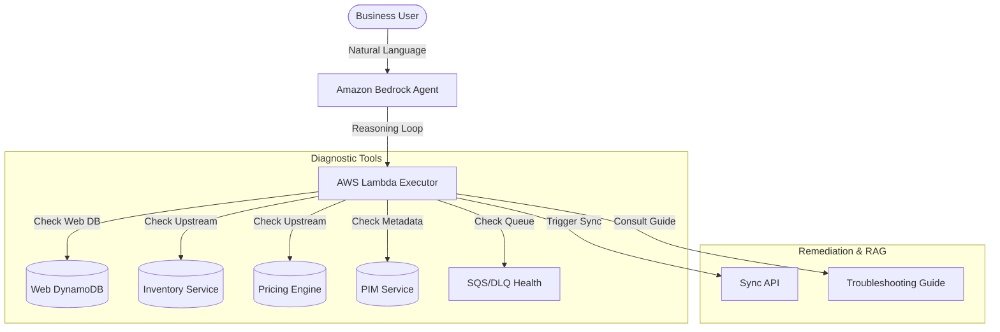

# 🤖 Autonomous E-Commerce Diagnostic & Remediation Agent

An "Agentic" serverless solution powered by **Amazon Bedrock** that autonomously diagnoses, remediates, and verifies sellability issues in e-commerce systems.

## 🚀 Overview

In large-scale e-commerce, synchronization between upstream systems (Inventory Service, Pricing Engine, PIM Service) and the web database (DynamoDB) often fails due to transient race conditions or data inconsistencies. This project implements a **self-healing** diagnostic agent that business users can query in natural language to repair product data discrepancies automatically.

### **✨ Key Features**
*   **⛓️ Agentic Chain-of-Thought**: The agent uses an autonomous reasoning loop (**Diagnose → Investigate → Remediate → Verify**) instead of simple scripts.
*   **🛠️ Self-Healing Auto-Remediation**: Automatically detects transient "Database Lock" errors (race conditions) in the Dead Letter Queue (DLQ) and triggers a manual override sync.
*   **📚 Agentic RAG (Mock Knowledge Base)**: Features a `queryTroubleshootingGuide` tool that allows the agent to "research" technical error codes manually before deciding on a resolution.
*   **✅ Closed-Loop Verification**: After performing a fix, the agent proactively re-checks the web state to ensure the product is truly "Sellable" before notifying the user.

---

## 🏗️ Architecture



---

## 🛠️ Tech Stack

*   **AI Orchestration**: Amazon Bedrock Agents (Claude 3 Sonnet)
*   **Compute**: AWS Lambda (TypeScript / Node.js 18.x)
*   **Infrastructure**: Serverless Framework (Infrastructure as Code)
*   **Security**: IAM Roles & Action Group Permissions

---

## 📂 Project Structure

*   `src/handlers/executor.ts`: The core "Action Group" executor where the diagnostic and remediation logic lives.
*   `serverless.yml`: Defines the Bedrock Agent, Action Groups, and Lambda permissions.
*   `src/handlers/chat.ts`: A helper function for programmatically interacting with the agent.

---

## 🚀 Getting Started

### **Prerequisites**
*   Active AWS Account with **Amazon Bedrock Model Access** (Claude 3 Sonnet).
*   **Serverless Framework** installed (`npm install -g serverless`).
*   AWS CLI configured with necessary permissions.

### **Deployment**
1.  Clone the repository:
    ```bash
    git clone [your-repo-url]
    cd bedrock-full-reconciliation
    ```
2.  Install dependencies:
    ```bash
    npm install
    ```
3.  Deploy to AWS:
    ```bash
    sls deploy --stage dev
    ```

---

## 📖 Example Scenario: "Self-Healing"

**User**: *"Why is product prod_9982 not showing up on the site?"*

1.  **Diagnosis**: Agent calls `checkWebDatabase` (Result: Status is `NOT_SELLABLE` due to 0 inventory).
2.  **Comparison**: Agent calls `checkInventoryService` (Result: Core system has **150 units** in stock).
3.  **Root Cause Analysis**: Sensing a discrepancy, the agent calls `checkDeadLetterQueue` and finds a `ConsumerDatabaseTimeoutException` (Race Condition).
4.  **Research**: Agent calls `queryTroubleshootingGuide` and learns that an autonomous `syncSystem` override will resolve this lock contention.
5.  **Remediation**: Agent calls `syncSystem(system="inventory")` to force-refresh the web database.
6.  **Verification**: Agent re-runs `checkWebDatabase` and confirms the site is now `SELLABLE`.
7.  **Resolution**: Agent informs the user the diagnostic and repair are complete!

---

## ✍️ Author
**Palamkunel Sujith** - *AI & Serverless Architect*
- LinkedIn: [https://www.linkedin.com/in/sujithpvarghese/]

## ⚖️ License
Distributed under the MIT License.
